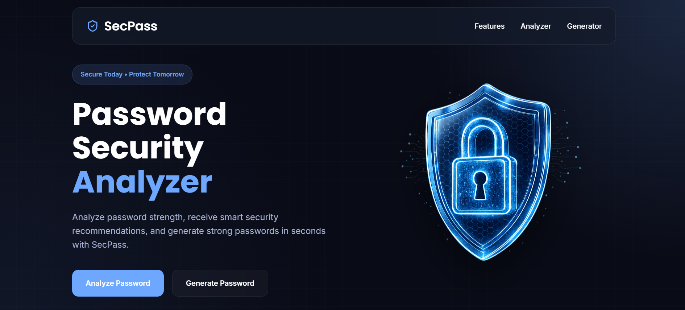

# SecPass

#### Video Demo: <https://www.youtube.com/watch?v=dTvXtK1iU88>

## Description

SecPass is a web-based password security analyzer built using Flask, HTML, CSS, and JavaScript. The purpose of this project is to help users evaluate the strength of their passwords by analyzing them against several security criteria. In addition to analyzing passwords, the application can suggest improvements and generate strong, secure passwords for users.

I chose this project because password security is an important part of cybersecurity, which is one of the areas that interests me. Many users create weak passwords without realizing the risks, so I wanted to build a simple tool that helps users understand how secure their passwords are and encourages them to create stronger ones.

## Features

The application provides several features, including:

- Password strength analysis.
- Password score calculation.
- Security recommendations based on the analysis.
- Detection of common passwords.
- Detection of repeated and sequential characters.
- Strong password generation.
- Password improvement suggestions.
- Password show/hide functionality.
- One-click password copy.
- Password security tips popup.
- Custom error pages.

The goal is not only to tell users whether their password is weak or strong, but also to explain why and provide suggestions to improve it.

## Password Scoring System

The application evaluates each password by checking several security criteria. Each criterion contributes to the final score as shown below.

| Criterion | Score |
|-----------|------:|
| Password length is at least 8 characters | +20 |
| Password length is at least 12 characters | +10 |
| Contains uppercase letters | +15 |
| Contains lowercase letters | +15 |
| Contains numbers | +20 |
| Contains special characters | +20 |

The application also detects common security issues that reduce the password strength.

| Security Issue | Effect |
|----------------|--------|
| Common password | Final score is limited to **20** |
| Repeated characters | −15 points |
| Sequential characters (e.g. `1234`, `abcd`) | −15 points |

After calculating the final score, the password is classified into one of the following strength levels.

| Score | Strength |
|------:|----------|
| 0 – 25 | Very Weak |
| 26 – 49 | Weak |
| 50 – 69 | Medium |
| 70 – 89 | Strong |
| 90 – 100 | Very Strong |

## Project Structure

The project is organized into multiple files to make the code easier to read and maintain.

### app.py

This is the main Flask application. It creates the application, defines the routes, receives requests from the frontend, calls the password analysis and generation functions, and returns the results as JSON. It also includes custom error handlers that display user-friendly pages for common HTTP errors.

### utils/analyzer.py

This file contains the main password analysis logic. It checks password length, character variety, repeated characters, sequential patterns, common passwords, calculates the strength score, and generates recommendations.

### utils/generator.py

This file contains the password generation logic. It creates secure passwords using a mixture of uppercase letters, lowercase letters, numbers, and special characters.

### templates/

This folder contains the HTML templates used by the Flask application, including the main interface and custom error pages.

### static/

This folder contains the project's CSS, JavaScript, images, icons, and other static assets used by the website.

### common_passwords.txt

This file contains a list of common passwords that are considered insecure. During analysis, the application checks whether the entered password exists in this list.

## How the Project Works

When a user enters a password, JavaScript sends it to the Flask backend using an HTTP request. Flask receives the password and passes it to the analysis functions inside the utility module.

The analyzer evaluates several security factors such as password length, uppercase and lowercase letters, numbers, symbols, repeated characters, sequential characters, and whether the password is a common password. Based on these checks, the application calculates a strength score and generates personalized recommendations.

The results are then returned to the frontend, where they are displayed in an easy-to-read interface. Users can also generate a new secure password, copy it with one click, show or hide passwords, and use the built-in password tips to create stronger passwords.

## Why Flask?

I chose Flask because it is lightweight, easy to understand, and suitable for small and medium-sized web applications. It also integrates well with HTML, CSS, and JavaScript while allowing the backend logic to be written in Python.

## Design Decisions

During development, I decided to separate the project into multiple modules instead of placing all the code inside a single file. This made the project more organized, easier to understand, and easier to maintain.

The password analysis and password generation logic were placed inside the `utils` folder, while `app.py` was responsible only for handling the Flask application and routing. This separation follows a cleaner project structure and makes future improvements easier.

I also designed the interface to be simple while still looking modern so users can understand the analysis results quickly. Interactive features such as password visibility toggling, one-click copying, loading animations, popup tips, and custom error pages were added to improve the overall user experience while keeping the interface clean and intuitive.

## Challenges

One of the biggest challenges was designing the user interface. I spent a significant amount of time creating a style that looked modern, consistent, and professional while ensuring that all sections matched each other visually.

Another challenge was converting the project into a Flask application. I initially started developing the frontend using HTML, CSS, and JavaScript, and later integrated it with Flask. Organizing the backend, connecting it with the frontend, and restructuring the project required additional time and effort.

## Future Improvements

In the future, I would like to add more features, such as checking passwords against online data breach databases, allowing users to save password history, supporting multiple languages, and adding user accounts with authentication.

Overall, this project allowed me to combine frontend and backend development while applying what I learned in CS50. I would like to thank the CS50 team for providing an amazing learning experience.